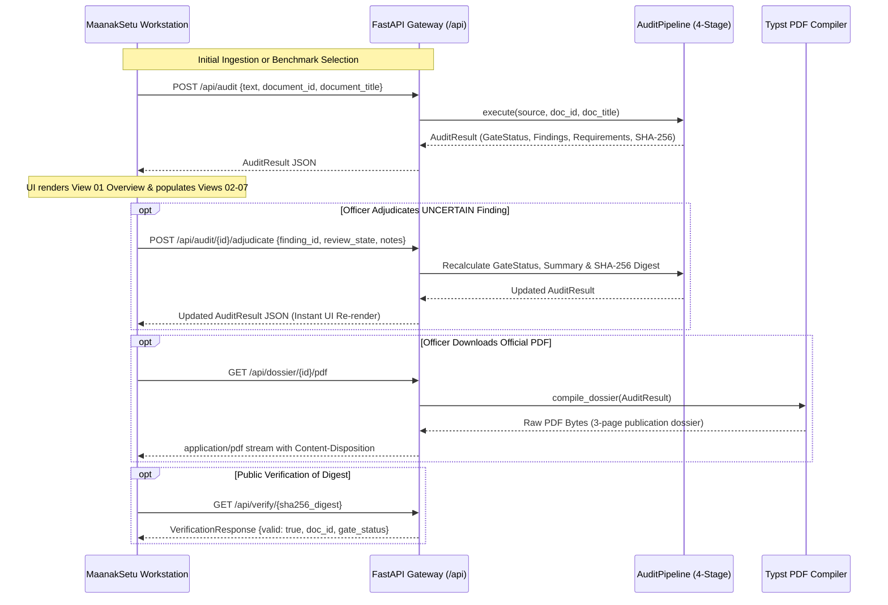

# MaanakSetu — UI Information Architecture & Interaction Specification

**Document Version:** 1.0  
**Author:** Lead Design Architect  
**System:** MaanakSetu (मानक सेतु) — National Standards Verification Workstation  
**Statutory Scope:** BIS Act 2016 & General Financial Rules 2017  
**Status:** Approved Information Architecture Specification  

---

## 1. Master Layout Anatomy & Structural Shell

The MaanakSetu user interface is organized into a **rigid, four-tier spatial frame** that remains constant across all user operations. This eliminates layout shifts, preserves operational context, and anchors the auditor at all times.

```
+───────────────────────────────────────────────────────────────────────────────────────────────────+
| TIER 1: PERSISTENT INSTITUTIONAL CONTEXT HEADER (64px)                                            |
| [Emblem] MAANAKSETU | National Standards Verification Workstation                                  |
| TENDER: TENDER-NHAI-2026-CEMENT  [STATUTORY_NON_COMPLIANT]  FINDINGS: 2  CASES: 14  [EXPORT DOSSIER]|
+───────────────────────────────────────────────────────────────────────────────────────────────────+
| TIER 2: WORKSTATION VIEW RIBBON (44px)                                                            |
| [01 OVERVIEW]  02 TRIAGE  03 STANDARDS  04 NORMATIVE DAG  05 INVARIANTS  06 CORRIGENDA  07 DOSSIER    |
+───────────────────────────────────────────────────────────────────────────────────────────────────+
| TIER 3: ACTIVE CORPUS BAR & BENCHMARK SWITCHER (38px)                                             |
| BENCHMARK CORPUS: [NHAI-CEMENT]  CPWD-REBAR  DISCOM-TRANSFORMER  AIIMS-MEDGAS  [+ AUDIT CUSTOM TENDER]|
+───────────────────────────────────────────────────────────────────────────────────────────────────+
| TIER 4: PRIMARY AUDIT VIEWPORT (Dynamic Height: calc(100vh - 194px))                              |
|                                                                                                   |
| [ Dedicated Full-Width Executive Surface (Views 01, 07) OR 40/60 Asymmetric Split (Views 02-06) ]  |
|                                                                                                   |
+───────────────────────────────────────────────────────────────────────────────────────────────────+
| TIER 5: PERSISTENT AUDIT FOOTER & KEYBOARD COMMAND BAR (48px)                                     |
| [<- PREVIOUS VIEW]            [1-7] DIRECT JUMP | [<- / ->] TRAVERSE            [NEXT VIEW ->]    |
| Bureau of Indian Standards & General Financial Rules 2017 | SpecGuard Deterministic Engine         |
+───────────────────────────────────────────────────────────────────────────────────────────────────+
```

---

## 2. Detailed View-by-View Information Architecture

### View 01: [01 OVERVIEW & GATE] (Level 1 Executive Decision Surface)
- **Purpose:** Provide tender evaluation committees and vigilance officers with an immediate, definitive answer-first evaluation of the specification document.
- **Layout:** Full-width structured executive surface.
- **Components:**
  1. **Tender Identification Card:**
     - Left: Tender Document ID (`TENDER-NHAI-2026-CEMENT`), Title (`NHAI Expressway Pavement & Reinforced Concrete`), Procuring Authority (`Ministry of Road Transport and Highways - MoRTH`), Category (`Civil / Highway Infrastructure`).
     - Right: Auxiliary Triage Weight (`Score: 58/100 [Sorting Priority Heuristic]`).
  2. **Document Gate Status Banner (Authoritative Conformance State):**
     - High-contrast bordered card indicating the exact `GateStatus`:
       - `STATUTORY_NON_COMPLIANT` (Red `#DC2626`): $\ge 1$ Mandatory Regulatory Mandate violated under BIS Act § 16 or GFR Rule 173(v).
       - `TECHNICAL_DEFECT` (Amber `#D97706`): $\ge 1$ Technical parameter, scope boundary, or amendment constraint failed.
       - `ACTION_REQUIRED_REVIEW` (Blue `#2563EB`): 0 confirmed defects, but $\ge 1$ requirement halted in `UNCERTAIN` state requiring human review.
       - `VERIFIED_CONFORMANT` (Emerald `#059669`): All requirements proved compliant against active gazetted standards.
  3. **Discrete Defect Accounting Ledger:**
     - Six distinct tabular metric boxes:
       - `REQUIREMENTS EVALUATED`: Total parsed requirements count (e.g. `14`).
       - `CONFORMANT CLAUSES`: Number of compliant clauses (e.g. `12`).
       - `CRITICAL VIOLATIONS`: Severe statutory infractions (e.g. `1`).
       - `HIGH VIOLATIONS`: Technical parameter or brand name infractions (e.g. `1`).
       - `CASCADING ALERTS`: Normative dependency risks (e.g. `1`).
       - `PENDING REVIEWS`: Requirements in `UNCERTAIN` state (e.g. `0`).
  4. **Executive Narrative Summary Box:**
     - AI-assisted synthesis summarizing the audit findings in formal procurement language (generated from `AuditResult.narrative_summary`).
  5. **Critical Infractions Triage Matrix ("What Needs Attention?"):**
     - Card 1: `01 // OBSOLETE STANDARD`: `IS 269:1989 -> IS 269:2015`. Citations: `BIS Act 2016 Section 16`. Action: `[EXAMINE CORRIGENDUM ->]`.
     - Card 2: `02 // PROPRIETARY SPECIFICATION`: `UltraTech / ACC Cement`. Citations: `GFR 2017 Rule 144(i) & Competition Act 2002`. Action: `[EXAMINE CORRIGENDUM ->]`.
  6. **Cascading Normative Risk Alert:**
     - Amber-bordered callout explaining how parent code `IS 456:2000` normatively cites withdrawn standard `IS 269:1989`.
  7. **Collapsible Raw Tender Prose Drawer (Level 5):**
     - Expandable accordion (`v INSPECT RAW TENDER PROSE`) revealing the exact unedited tender clauses with cryptographic verification: `SHA-256: 9f08d018b4ec...`.
  8. **Primary Action:**
     - `EXAMINE CORRIGENDA & PROOF ->` driving the user directly into View 06.

---

### View 02: [02 CLAUSE TRIAGE] (Clause Extraction & Triage Workspace)
- **Purpose:** Enable technical evaluators to inspect decomposed specification clauses, review extracted parameters, and verify classification.
- **Layout:** 40/60 Asymmetric Split Workstation.
- **Components:**
  - **40% Left Master Pane (Scrollable Clause Selector):**
    - Filter Tabs: `ALL [14]`, `FLAGGED [2]`, `UNCERTAIN [0]`, `COMPLIANT [12]`.
    - Search Filter: Search by clause text, number, or cited keyword.
    - Clause Cards:
      - Clause Number / ID (`Clause 4.1 - Material Quality`).
      - Functional Category Tag (`TECHNICAL_SPECIFICATION`, `COMMERCIAL_TERMS`).
      - Status Badge (`FLAGGED` in red, `COMPLIANT` in green, `PENDING_REVIEW` in blue).
      - Brief snippet of clause text.
  - **60% Right Sticky Inspector Pane (Clause Specification Deep Dive):**
    - Header: `INSPECTION // CLAUSE 4.1 (MATERIAL QUALITY)`.
    - Statutory Status: `Non-Compliant Specification (Cites Withdrawn Indian Standard)`.
    - Raw Clause Text Box: Complete unedited text from tender segment.
    - Extracted Requirement Table:
      - Product Name: `Ordinary Portland Cement 43 Grade`.
      - Application Context: `High-stress rigid pavement slabs`.
      - Parameter Constraints: `Compressive strength: MIN 43 MPa`.
      - Cited Standards: `IS 269:1989`.
      - Cited Brands: `None`.
    - Associated Verification Finding Card (if flagged).
    - Direct Jump Button: `VIEW STATUTORY CORRIGENDUM ->`.

---

### View 03: [03 STANDARDS CATALOG] (Authoritative Standards Knowledge Base)
- **Purpose:** Search and explore the authoritative Bureau of Indian Standards (BIS) knowledge cartridge loaded into the engine.
- **Layout:** 40/60 Asymmetric Split Workstation.
- **Components:**
  - **40% Left Master Pane (Standards Directory):**
    - Search Bar: Search by IS number (`IS 269`), title (`Portland Cement`), or keyword.
    - Status Filter: `ALL`, `ACTIVE`, `WITHDRAWN`, `SUPERSEDED`.
    - Standard Cards:
      - IS Number (`IS 269:2015`).
      - Title (`Ordinary Portland Cement — Specification`).
      - Status Pill (`ACTIVE` in green, `WITHDRAWN` in red).
      - Revision Number & Gazette Notification Reference.
  - **60% Right Sticky Inspector Pane (Standard Knowledge Card):**
    - Title & Metadata Header: Full code, year, governing body (`Bureau of Indian Standards`), gazette date.
    - Statutory Directives: Mandatory Quality Control Order (QCO) coverage (`Cement QCO 2020 S.O. 1419(E)`).
    - Scope Boundary Box:
      - Included applications (e.g. general civil construction).
      - Excluded applications (e.g. road bridges $\rightarrow$ alternative `IRC:112`).
    - Authoritative Technical Constraints Table:
      - Parameter Name, Grade, Minimum Value, Maximum Value, Unit, Mandatory Test Method Standard.
    - Gazetted Revision Deltas (Amendments):
      - Amendment 1, 2, 3 with effective dates and parameter changes.

---

### View 04: [04 NORMATIVE DAG] (Normative Dependency Graph Explorer)
- **Purpose:** Visualize multi-hop standard citations and detect hidden cascading obsolescence along the normative reference tree.
- **Layout:** Full-height interactive visual graph canvas with a side resolution inspector.
- **Components:**
  - **Top Cascading Alert Banner:**
    - High-visibility warning: `CASCADING NORMATIVE RISK DETECTED: IS 456:2000 -> IS 269:1989 (WITHDRAWN)`.
    - Explanatory rationale: *"Parent standard IS 456:2000 is ACTIVE, but normatively mandates IS 269:1989 for cement requirements. Specifying the obsolete standard invalidates characteristic compressive strength calculations."*
  - **Center Interactive DAG Canvas (`@xyflow/react`):**
    - Root Standard Node (`IS 456:2000 [ACTIVE]`).
    - Normative Dependency Edge (`normatively references [Depth: 1 Hop]`).
    - Sub-Reference Node (`IS 269:1989 [WITHDRAWN]`).
    - Supersession Edge (`superseded by Gazette S.O. 3177(E)`).
    - Successor Node (`IS 269:2015 [ACTIVE]`).
    - Interactive controls: Pan, zoom, node selection, depth slider (1 to 4 hops).
  - **Right Resolution Panel:**
    - Selected Node / Edge Details: Root Structural Code, Sub-Ref Status, Active Replacement (`IS 269:2015`), Engineering Risk Assessment.

---

### View 05: [05 RULES & INVARIANTS] (Rule Invariants & Sovereign Adjudication)
- **Purpose:** Inspect the deterministic rulebook evaluated by SpecGuard and provide a dedicated surface for authorized officers to adjudicate uncertain findings.
- **Layout:** 50/50 Split Verification & Adjudication Workspace.
- **Components:**
  - **50% Left Column (Evaluated Rules Ledger):**
    - Suite of evaluated invariant rules:
      - `INV-01: Obsolete Standard Prohibition` (`RULE-LIFECYCLE-CURRENCY`): `VIOLATED [CRITICAL]`.
      - `INV-02: Proprietary Brand Exclusion` (`RULE-BRAND-EXCLUSION`): `VIOLATED [HIGH]`.
      - `INV-03: Mandatory Quality Control Orders` (`RULE-QCO-MANDATORY`): `SATISFIED`.
      - `INV-04: Contradictory Test Criteria` (`RULE-PARAM-CONSTRAINT`): `SATISFIED`.
      - `INV-05: Scope Boundary Check` (`RULE-SCOPE-EXCLUSION`): `SATISFIED`.
    - Each rule card displays the evaluated condition, input parameters, and statutory basis.
  - **50% Right Column (Human Sovereign Adjudication Panel):**
    - Header: `SOVEREIGN HUMAN ADJUDICATION WORKSPACE`.
    - Context: Displays findings in `UNCERTAIN` or `PENDING_REVIEW` state.
    - Adjudication Form:
      - Target Finding Selector.
      - Authority Identity Input (e.g. `Chief Technical Examiner / CVO`).
      - Adjudication Action:
        - `CONFIRMED_DEFECT` (Transitions finding to `VIOLATION`).
        - `DISMISSED_CONFORMANT` (Dismisses finding as `CONFORMANT`).
        - `EXCEPTION_RECORDED` (Logs formal statutory exception under Rule 173(v)).
      - Statutory Justification Notes Textarea.
      - Action Button: `SUBMIT SOVEREIGN ADJUDICATION` (triggers `POST /api/audit/{id}/adjudicate`).
      - Audit confirmation note: *"Submitting recalculates Document Gate Status and recomputes the SHA-256 state digest."*

---

### View 06: [06 CORRIGENDA & PROOF] (Statutory Redline & Evidentiary Proof)
- **Purpose:** Provide the primary actionable remediation workbench: side-by-side corrigenda for gazette publication, deterministic legal trace, and 5-node provenance tuple.
- **Layout:** 30/70 Asymmetric Remediation Workbench.
- **Components:**
  - **30% Left Column (Infraction Selector):**
    - List of detected infractions:
      - `ITEM 01: IS 269:1989 Obsolete Standard` (`Clause 4.1`, Severity: `CRITICAL`).
      - `ITEM 02: UltraTech / ACC Brand Restriction` (`Clause 4.2`, Severity: `HIGH`).
    - Statutory grounding summary tags (`BIS Act § 16`, `GFR Rule 144(i)`).
  - **70% Right Column (3-Way Proof Canvas):**
    - Tab Switcher: `[CORRIGENDUM REDLINE]` | `[LEGAL TRACE]` | `[5-NODE PROVENANCE]`.
    - **Tab 1: `[CORRIGENDUM REDLINE]`**:
      - Side-by-Side Comparison:
        - Left Panel: `DEFECTIVE TENDER PROSE` (highlighted in red with clause citation).
        - Right Panel: `STATUTORY CORRIGENDUM (PUBLICATION-READY)` (highlighted in green with 1-click `COPY TO CLIPBOARD` button formatted for GeM/CPPP publication).
      - Statutory Basis Citation: Exact legal grounding under GFR Rule 173(v) and BIS Act.
      - Engineering Rationale: Technical explanation of why the modification is required.
    - **Tab 2: `[LEGAL TRACE]`**:
      - Unbroken deterministic 3-step proof chain:
        1. *Tender Specification Clause* $\rightarrow$ cites un-gazetted or obsolete standard.
        2. *Authoritative Standards Fact* $\rightarrow$ Gazette S.O. 3177(E) declared standard superseded.
        3. *Statutory Invariant* $\rightarrow$ BIS Act 2016 Section 16 prohibits procurement of non-conforming goods.
    - **Tab 3: `[5-NODE PROVENANCE]`**:
      - Structured visual display of the formal 5-node tuple:
        $$\mathcal{E} = \langle \text{FindingId}, \text{RuleId}, \text{KnowledgeFactRef}, \text{RequirementRef}, \text{SourceSegmentRef} \rangle$$
      - Raw machine-readable JSON schema of the finding object for legal archives and API federation.

---

### View 07: [07 AUDIT DOSSIER] (Official Audit Dossier & Cryptographic Verification)
- **Purpose:** Render the official printable audit report, verify cryptographic integrity, and stream the publication-grade Typst PDF.
- **Layout:** Full-width document preview surface.
- **Components:**
  - **Top Action Header:**
    - Left: Document verification indicator (`Cryptographic State: VERIFIED`).
    - Right: Primary Action Button: **`DOWNLOAD AUDIT DOSSIER (PDF)`** (triggers `GET /api/dossier/{document_id}/pdf`).
  - **Official Document Container (A4 Printable Layout):**
    - Institutional Header:
      - `GOVERNMENT OF INDIA — STATUTORY PROCUREMENT AUDIT`
      - `MaanakSetu Compliance Dossier`
    - Document Metadata Grid:
      - Tender ID, Procuring Authority, Audit Date, Total Clauses, Document Gate Status (`STATUTORY_NON_COMPLIANT`).
    - Section 1: Executive Conformance Determination:
      - Formal paragraph summarizing findings and legal status.
    - Section 2: Discrete Defect Accounting Table:
      - Breakdown of total requirements, conformant items, critical violations, and high violations.
    - Section 3: Statutory Corrigendum Schedule (Mandatory CPPP/GeM Publication):
      - Formatted table listing each defective clause, statutory grounds, and publication-ready replacement text.
    - Section 4: Human Sovereign Adjudication Record (if adjudicated):
      - Adjudicator Officer ID, Decision, Timestamp, and Statutory Notes.
    - Section 5: Cryptographic State Digest (SHA-256):
      - Full 64-character hexadecimal digest (`9f08d018b4ec7d65...`) with `COPY DIGEST` button.
      - Public Verification URL: `https://maanaksetu.gov.in/api/verify/9f08d018b4ec7d65...`.

---

## 3. Data Flow & API Contract Mapping



---

## 4. Keyboard Navigation & Interaction Matrix

| Key Binding | Target Action | Scope |
| :--- | :--- | :--- |
| `1` | Jump to View 01: `OVERVIEW & GATE` | Global |
| `2` | Jump to View 02: `CLAUSE TRIAGE` | Global |
| `3` | Jump to View 03: `STANDARDS CATALOG` | Global |
| `4` | Jump to View 04: `NORMATIVE DAG` | Global |
| `5` | Jump to View 05: `RULES & INVARIANTS` | Global |
| `6` | Jump to View 06: `CORRIGENDA & PROOF` | Global |
| `7` | Jump to View 07: `AUDIT DOSSIER` | Global |
| `ArrowRight` / `]` | Navigate to Next View | Global |
| `ArrowLeft` / `[` | Navigate to Previous View | Global |
| `Escape` | Dismiss modal dialogs / drawers | Modal / Drawer |
| `Ctrl+C` (on button) | Copy publication-ready corrigendum or SHA-256 hash | Local button |

This completes the authoritative Information Architecture for the MaanakSetu Workstation.
